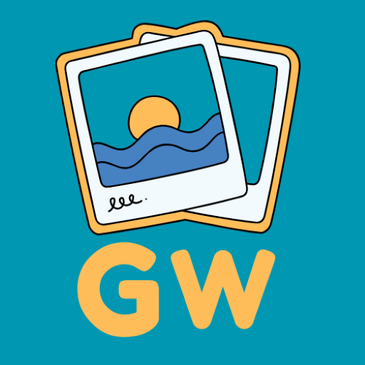

# GoodWalls App



A wallpaper application with Native Java Android App client and PHP/MySQL backend server. The app allows users to browse, download and set wallpapers and live wallpapers.

[](https://github.com/aamitn/goodwalls/actions/workflows/publish.yml)

[](https://play.google.com/store/apps/details?id=com.app.goodwalls1)

<br>

## Project Location

| **Android App**                    | **Backend**                    |
|------------------------------------|--------------------------------|
| [`Location`](./android_app/)       | [`Location`](./backend/)       |
| [`Readme`](./android_app/README.md)  | [`Readme`](./backend/README.md)  |


>### `Documentation` : https://bitmutex.gitbook.io/goodwalls-docs/


## DirStruct
```
/goodwalls
├── android_app/   # Android-Studio Project for Android App
├── backend/       # PHP/MYSQL Backend Project
├── docs/          # GitBook Documentation Source MD Files
└── docs.html      # Local Docs Viewer redirecting to gitbook site
```

## Requirements

### Android App
- Android Studio
- Minimum SDK version: Android 5.0 (API 21)
- Max Target SDK : Android 15 (API 35)
- Gradle build system

### Backend
- PHP 7.0+
- MySQL 5.6+
- Apache web server mod_rewrite enabled / nginx

## Setup

1. Import the database schema from [`/backend/material_wallpaper_db.sql`](./backend/material_wallpaper_db.sql)

2. Configure backend:
   - Update database credentials in `/backend/includes/config.php`
   - Configure server paths in Apache

3. Configure Android app:
   - Update API endpoint in `Config.java`
   - Update package name in `build.gradle`
   - Generate signing keystore

## License
Copyright © [Bitmutex Technologies](https://www.bitmutex.com)

This program is free software: you can redistribute it and/or modify it under the terms of the GNU General Public License as published by the Free Software Foundation, version 3.

This program is distributed in the hope that it will be useful, but WITHOUT ANY WARRANTY; without even the implied warranty of MERCHANTABILITY or FITNESS FOR A PARTICULAR PURPOSE. See the GNU General Public License for more details.

You should have received a copy of the GNU General Public License along with this program. If not, see <https://www.gnu.org/licenses/>. 

